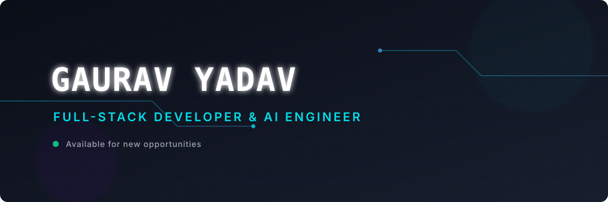

<div align="center">
  
</div>

<h1 align="center">
  
</h1>

<p align="center">
  I build modern, high-performance web applications and intelligent AI-powered experiences.<br/>
  Passionate about clean architecture, beautiful UI, and agentic workflows.
</p>

<p align="center">
  <a href="https://linkedin.com/in/YOUR_LINKEDIN_USERNAME" target="_blank">
    
  </a>
  <a href="mailto:your.email@example.com">
    
  </a>
  <a href="https://github.com/GauravYadav-G" target="_blank">
    
  </a>
  
</p>

<br/>

## 💫 About Me

```typescript
const gaurav = {
  role:       "Full-Stack Developer & AI Engineer",
  focus:      ["React/Next.js systems", "Serverless architectures", "AI-driven features"],
  learning:   ["Agentic AI frameworks", "Rust"],
  passion:    "Building scalable systems with elegant user experiences",
  funFact:    "Code should not only work — it should look like art too 🎨",
};
```

- 🔭 **Currently focused on:** React/Next.js systems, serverless architectures, and AI-driven product features
- 🌱 **Currently learning:** Advanced agentic AI frameworks and Rust
- 💡 **What I enjoy:** Building scalable systems with elegant user experiences
- ⚡ **Fun fact:** I believe code should not only work — it should look like art too

<br/>

## 🛠️ Tech Stack

### 🌐 Frontend Engineering
<p>
  
  
  
  
  
  
</p>

### ⚙️ Backend & Systems
<p>
  
  
  
  
  
  
</p>

### ☁️ Tools & Platforms
<p>
  
  
  
  
</p>

<br/>

## 🚀 What I Build

<table>
  <tr>
    <td>⚡ Scalable full-stack web applications</td>
    <td>🎨 Responsive & polished frontend interfaces</td>
  </tr>
  <tr>
    <td>🤖 AI-integrated user experiences</td>
    <td>☁️ Serverless & cloud-native systems</td>
  </tr>
  <tr>
    <td>🧠 Smart agent-based workflows</td>
    <td>🔧 Automation & developer tooling</td>
  </tr>
</table>

<br/>

## 📊 GitHub Analytics

<div align="center">
  
  
</div>

<div align="center">
  
</div>

<div align="center">
  
</div>

<br/>

## 🏆 GitHub Trophies

<div align="center">
  
</div>

<br/>

## 🤝 Connect With Me

<p align="center">
  <a href="https://linkedin.com/in/YOUR_LINKEDIN_USERNAME" target="_blank">
    
  </a>
  <a href="mailto:your.email@example.com">
    
  </a>
  <a href="https://github.com/GauravYadav-G" target="_blank">
    
  </a>
</p>

---

<div align="center">
  
  <br/>
  <sub>Designed with ❤️ by Gaurav Yadav</sub>
</div>
